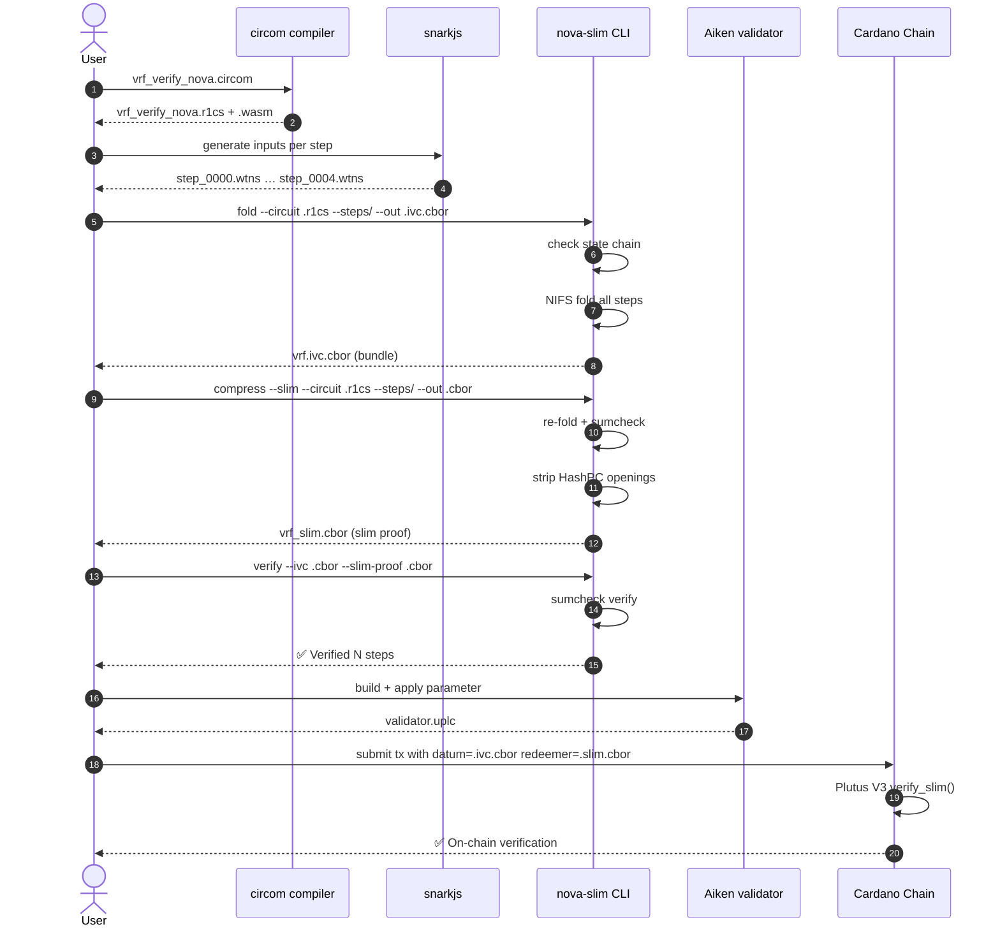

# NovaSlim End-to-End Guide

A step-by-step walkthrough of the complete NovaSlim flow, from circuit compilation
to on-chain verification.

## What You Need

- `nova-slim` CLI (build from `cli/` with `cargo build --release`)
- `circom` compiler
- `snarkjs` (for witness generation)
- `aiken` v1.1.21+ (for on-chain verifier)

## The Flow (Big Picture)


**Green** = prover work. **Yellow** = off-chain verifier. **Red** = on-chain verifier.

---

## Step 1: Compile the Circuit

A step circuit defines one iteration of your computation. For this guide we use the
VRF scalar-multiplication step (JubJub curve, 4 public I/O signals).

```bash
cd cardano/cip197

# Compile the circom circuit
circom -l ../../circom/Ed25519Verify/node_modules/circomlib/circuits -l . \
  ../../circom/VRF/vrf_verify_nova.circom \
  --r1cs --wasm --sym

# You now have:
#   vrf_verify_nova.r1cs      ← circuit constraints
#   vrf_verify_nova_js/       ← WASM witness generator
```

**What this does:** Converts the circom source into a binary R1CS file that
NovaSlim can load.

---

## Step 2: Generate Witnesses

Each step needs a witness file (`step_0000.wtns`, `step_0001.wtns`, …) that assigns
concrete values to every wire in the circuit.

```bash
# Generate 5 step witnesses using snarkjs
python3 ../../benchmarks/gen_vrf_witnesses.py \
  --wasm vrf_verify_nova_js/vrf_verify_nova.wasm \
  --steps 5 \
  --dir poc_witnesses

# You now have:
#   poc_witnesses/step_0000.wtns
#   poc_witnesses/step_0001.wtns
#   …
```

**What this does:** For each step, runs the WASM circuit with concrete inputs
(public + private) and records every intermediate wire value.

**Important:** Witness files must form a valid state chain — the public outputs of
step `i` must equal the public inputs of step `i+1`. NovaSlim checks this during
folding.

---

## Step 3: Fold the Steps

Folding combines all step witnesses into one constant-size bundle.

```bash
nova-slim fold \
  --curve bn254 \
  --commitment sis --sis-param 128 \
  --circuit vrf_verify_nova.r1cs \
  --steps poc_witnesses/ \
  --out vrf.ivc.cbor
```

**What this does:**
- Loads the R1CS circuit
- Reads every `.wtns` file in `poc_witnesses/`
- Checks the state chain is valid (output → input)
- Folds all steps into one Relaxed-R1CS instance
- Writes the NIFS bundle to `vrf.ivc.cbor`

**Output:** `vrf.ivc.cbor` (~8–9 KiB) — the folded instance + transcript.

---

## Step 4: Compress to Slim Proof

Compression turns the folded instance into a small proof using the sumcheck protocol.
With `--slim`, the HashPC opening proofs are stripped for on-chain use.

```bash
# Slim proof (on-chain variant)
nova-slim compress --slim \
  --curve bn254 \
  --commitment sis --sis-param 128 \
  --circuit vrf_verify_nova.r1cs \
  --steps poc_witnesses/ \
  --out vrf_slim.cbor
```

**What this does:**
- Re-folds the witnesses deterministically (same result as Step 3)
- Runs the sumcheck prover on the final relaxed instance
- Strips the HashPC opening proofs
- Writes the slim proof to `vrf_slim.cbor`

**Output:** `vrf_slim.cbor` (~0.4 KiB) — sumcheck data only.

**Without `--slim`** you get a full proof (~9–10 KiB) that includes HashPC openings
for off-chain audit.

---

## Step 5: Verify Off-Chain

### Slim verification (fast, no openings)

```bash
nova-slim verify \
  --curve bn254 \
  --commitment sis --sis-param 128 \
  --ivc vrf.ivc.cbor \
  --slim-proof vrf_slim.cbor
```

**What this checks:**
- The slim proof's sumcheck protocol is valid
- Fiat-Shamir challenges match the transcript
- The final claim is zero (relaxed R1CS satisfied)
- The proof is bound to this specific NIFS bundle

**Time:** ~8 ms

### Full verification (audit-grade, with openings)

```bash
nova-slim verify \
  --curve bn254 \
  --commitment sis --sis-param 128 \
  --ivc vrf.ivc.cbor \
  --sumcheck-proof vrf_full.cbor
```

**What this additionally checks:**
- HashPC opening proofs for witness W and error E
- Pedersen/SIS/Hash commitments match the bundle

**Time:** ~50–60 ms

---

## Step 6: Verify On-Chain (Aiken)

The Aiken verifier is at `../nova-slim-verifier/`.

```bash
cd ../nova-slim-verifier

# 1. Build the validator
aiken build

# 2. Apply the expected public input parameter
aiken apply plutus.json \
  --parameter-bytes <hex-encoded-public-input> \
  > validator.uplc

# 3. Submit to Cardano (example using cardano-cli)
cardano-cli transaction build-raw \
  --tx-in <your-input> \
  --tx-out <your-output> \
  --minting-script-file validator.uplc \
  --mint-redeemer-cbor-file ../../cardano/cip197/vrf_slim.cbor \
  --mint-script-datum-cbor-file ../../cardano/cip197/vrf.ivc.cbor \
  --out-file tx.raw
```

**What the validator checks:**
- `redeemer.public_input == expected_public_input`
- `verify_slim(datum, redeemer) == True`

The validator runs entirely in Plutus V3 using BLS12-381 scalar arithmetic.

---

## Mermaid: Complete Sequence



---

## Files at Each Stage

| Stage | Input | Output | Size (typical) |
|---|---|---|---|
| Compile | `.circom` | `.r1cs`, `.wasm` | ~1–50 KiB |
| Witness | `.wasm` + inputs | `step_####.wtns` | ~1–50 KiB each |
| Fold | `.r1cs` + `step_*.wtns` | `.ivc.cbor` | ~2–10 KiB |
| Compress | `.r1cs` + `step_*.wtns` | `_slim.cbor` | **~0.4 KiB** |
| Verify | `.ivc.cbor` + `.cbor` | pass/fail | — |

---

## Common Flags

| Flag | Meaning | Example |
|---|---|---|
| `--curve` | Elliptic curve (determines scalar field) | `bls12-381`, `bn254` |
| `--commitment` | Commitment scheme | `pedersen`, `sis`, `hash` |
| `--sis-param` | SIS output dimension (only for `--commitment sis`) | `4` (fast), `128` (PQ) |
| `--opt` | Optimizations | `parallel`, `lazy`, `all`, `none` |
| `--slim` | Strip openings for on-chain proof | — |

---

## Quick Test (Copy-Paste)

```bash
cd cardano/cip197

# Compile
circom -l ../../circom/Ed25519Verify/node_modules/circomlib/circuits -l . \
  ../../circom/VRF/vrf_verify_nova.circom --r1cs --wasm --sym

# Witnesses (5 steps)
python3 ../../benchmarks/gen_vrf_witnesses.py \
  --wasm vrf_verify_nova_js/vrf_verify_nova.wasm \
  --steps 5 --dir poc_witnesses

# Fold
nova-slim fold --curve bn254 --commitment sis --sis-param 128 \
  --circuit vrf_verify_nova.r1cs --steps poc_witnesses --out vrf.ivc.cbor

# Compress (slim)
nova-slim compress --slim --curve bn254 --commitment sis --sis-param 128 \
  --circuit vrf_verify_nova.r1cs --steps poc_witnesses --out vrf_slim.cbor

# Verify
nova-slim verify --curve bn254 --commitment sis --sis-param 128 \
  --ivc vrf.ivc.cbor --slim-proof vrf_slim.cbor
```

**Expected total time:** < 1 second for 5 steps.
