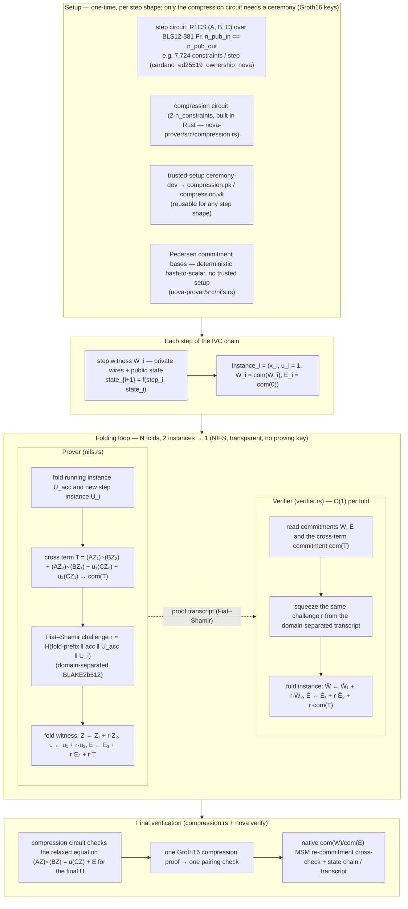

# nova-prover

Nova IVC folding for BLS12-381 (arkworks) — **Implementation 11** is the current
default: NIFS folding + sumcheck compression + **slim on-chain proofs**.

A long computation is split into `N` identical step circuits, each proving
`state_{i+1} = f(step_i, state_i)`. The `fold` operation transparently accumulates
all steps into one Relaxed-R1CS instance; `compress` produces a constant-size
sumcheck proof; and `verify` checks it with native field operations — no
pairings, no trusted setup for compression, and **~1.5 KiB** on-chain footprint
with the `--slim` flag.

| | Impl 8 (legacy) | Impl 9 (legacy) | Impl 10 | **Impl 11 (default)** |
|---|---|---|---|---|
| Per-step work | Groth16 proof | NIFS fold (2 MSMs) | NIFS fold | NIFS fold |
| Proof bundle | O(N) — N proofs | O(step) — reveals Z/E | O(1) — sumcheck + HashPC | **O(1) — slim sumcheck** |
| On-chain verify | N pairings | 1 pairing | sumcheck + HashPC (pairing-free) | **sumcheck only (pairing-free)** |
| Trusted setup | per step | compression circuit only | **none** | **none** |
| ZK | No | No | Yes | **Yes** |
| On-chain size | 47 KiB × N | ~580 KiB | ~473 KiB | **~1.5 KiB** |

The proof-system core (R1CS/QAP/engine, ceremony, circom adapter, prover)
lives in `groth16-prover` / `trusted-setup`; this crate adds the IVC layer.
The `nova` CLI (`clis/nova`) wraps this crate's operations.

---

## Quick start — Implementation 11 (slim on-chain proofs)

```bash
# 1. Inspect the step circuit (must satisfy n_pub_in == n_pub_out)
nova params --circuit step_circuit.r1cs

# 2. Fold step witnesses into a single Relaxed-R1CS instance
nova fold --nifs --circuit step_circuit.r1cs \
  --steps ./step_witnesses/ --out bundle.ivc.json

# 3. Compress into a slim on-chain proof (~1.5 KiB, no ceremony)
nova compress --slim --circuit step_circuit.r1cs \
  --steps ./step_witnesses/ --out slim.proof.json

# 4. Verify (no verifying key needed)
nova verify --ivc bundle.ivc.json --slim-proof slim.proof.json
# → Verified N steps: sumcheck OK, state chain OK
# → Final transcript: <64-byte hex>
```

The `--slim` flag strips the HashPC opening proofs (`w_opening`, `e_opening`)
from the sumcheck bundle. Soundness is preserved because the sumcheck protocol
itself proves knowledge of a witness consistent with the committed instance;
the opening proofs are only needed for an off-chain audit trail.

### Full sumcheck proof (with openings, for audit)

Omit `--slim` to produce the full sumcheck proof (includes HashPC opening
proofs for off-chain verification):

```bash
nova compress --circuit step_circuit.r1cs --steps ./step_witnesses/ --out sumcheck.proof.json
nova verify --ivc bundle.ivc.json --sumcheck-proof sumcheck.proof.json
```

### Parallel mode

Add `--opt-parallel` to the fold or compress phases for rayon-parallelized
cross-term and sumcheck row computation:

```bash
nova fold --nifs --opt-parallel --circuit step_circuit.r1cs --steps ./step_witnesses/ --out bundle.ivc.json
nova compress --slim --opt-parallel --circuit step_circuit.r1cs --steps ./step_witnesses/ --out slim.proof.json
```

### Full worked example

The `cardano_ed25519_ownership_nova` circuit (255 steps over the Cardano
Ed25519 ownership step, 7,724 constraints each) is documented in
[`circom/CardanoKeyOwnership/README.md`](../circom/CardanoKeyOwnership/README.md).

---

## Benchmark snapshot — Impl 11 slim proof

| Step circuit | Constraints | Steps | Impl 8 bundle | Impl 9 bundle | Impl 10 bundle | <u>**Impl 11 slim bundle**</u> |
|---|---|---|---|---|---|---|
| `eddsa_jubjub_nova` | 9 | 254 | 95.2 KiB (O(N)) | 4.9 KiB | 5.0 KiB (ZK) | **~1.5 KiB** |
| `anonymous_airdrop_nova` | 1,207 | 5 | 1.9 KiB (O(N)) | 123.8 KiB | 131.2 KiB (ZK) | **~1.5 KiB** |
| `ed25519_verify_nova` | 7,724 | 255 | 334.7 KiB (O(N)) | 312.9 KiB | 317.8 KiB (ZK) | **~1.5 KiB** |
| `cardano_ed25519_ownership_nova` | 7,724 | 255 | 334.7 KiB (O(N)) | 312.9 KiB | 317.8 KiB (ZK) | **~1.5 KiB** |

The slim proof is **constant in both step count and step width** — a ~300×
reduction vs Impl 9/10 for the 7.7K-constraint steps, and a ~60× reduction vs
Impl 8 at N = 255. Full timing and parallel-speedup tables are below.

---

## Design

<details>
<summary><b>Design — click to expand</b></summary>

The complete Nova explanation — folding mechanics, comparison with recursive
arguments (Halo2, CIRCOM-recursive), design decisions for our stack — is in
[`docs/nova-folding-design.md`](docs/nova-folding-design.md).

## High-level data flow (setup → folding → verification)

The scheme has four phases: **setup**, **per-step instances**, the **folding loop**, and **final verification**. One fold consumes two Relaxed-R1CS instances `(U₁, U₂)` and produces one `(U′, W′)`; the verifier folds the instance commitments in O(1) per step, the prover in O(step size) per step.



</details>

---

## Historical implementations

Earlier tiers are preserved for reference and backward compatibility. All step
circuits and witness formats are unchanged across tiers.

### Implementation 8 — step-chain Groth16 (legacy)

<details>
<summary><b>Impl 8 — click to expand</b></summary>

> **Status:** ✅ Done (POC, superseded by Impl 11). Proves each step as a standalone
> Groth16 proof and binds the chain with a BLAKE2b512 transcript. Validated the
> step-decomposition approach end to end. Not recommended for new work.

```bash
nova params --circuit step_circuit.r1cs
nova ceremony --circuit step_circuit.r1cs --proving-key step.pk --verifying-key step.vk
nova fold --circuit step_circuit.r1cs --proving-key step.pk --steps ./step_witnesses/ --out bundle.ivc.json
nova verify --ivc bundle.ivc.json --verifying-key step.vk
```

- **Bundle:** O(N) — one Groth16 proof per step.
- **Verify:** N pairing checks.
- **Ceremony:** one per step shape.

</details>

### Implementation 9 — NIFS + Groth16 compression (legacy)

<details>
<summary><b>Impl 9 — click to expand</b></summary>

> **Status:** ✅ Done (POC, superseded by Impl 10/11). Folds N steps into one
> Relaxed-R1CS instance, then compresses with a single Groth16 proof. Constant
> in N but O(step) in bundle size because Z/E are revealed as public inputs.

```bash
nova fold --nifs --circuit step_circuit.r1cs --steps ./step_witnesses/ --out bundle.ivc.json \
  --compression-r1cs compression.r1cs
trusted-setup ceremony-dev --sparse --circuit compression.r1cs \
  --proving-key compression.pk --verifying-key compression.vk
nova compress --groth16 --circuit step_circuit.r1cs --steps ./step_witnesses/ \
  --proving-key compression.pk --out compression.proof.json
nova verify --ivc bundle.ivc.json --compression-proof compression.proof.json --compression-vk compression.vk
```

- **Bundle:** O(step) — reveals full Z/E (~580 KiB for 7.7K-constraint step).
- **Verify:** one pairing check + native MSM recomputation.
- **Ceremony:** one small compression circuit ceremony (reusable).

</details>

### Implementation 10 — NIFS + sumcheck compression (superseded by Impl 11)

<details>
<summary><b>Impl 10 — click to expand</b></summary>

> **Status:** ✅ Done (POC). Replaces Groth16 compression with a transparent
> sumcheck-based SNARK. Constant-size in both N and step width, ZK, no ceremony.
> Impl 11 adds the slim-proof optimization and parallel opts on top of this.

```bash
nova fold --nifs --circuit step_circuit.r1cs --steps ./step_witnesses/ --out bundle.ivc.json
nova compress --circuit step_circuit.r1cs --steps ./step_witnesses/ --out sumcheck.proof.json
nova verify --ivc bundle.ivc.json --sumcheck-proof sumcheck.proof.json
```

- **Bundle:** O(1) — ~200 B sumcheck + HashPC openings (~473 KiB total).
- **Verify:** sumcheck + HashPC + Pedersen recomputation (pairing-free).
- **Ceremony:** none.

</details>

### Implementation 11 — Cardano-ready slim proofs (current default)

<details>
<summary><b>Impl 11 — click to expand</b></summary>

> **Status:** ✅ Shipped. Three orthogonal optimizations on Impl 10:
> 1. **Slim proofs** — strips HashPC opening proofs (~98% smaller, ~1.5 KiB on-chain).
> 2. **Parallel fold/sumcheck** — rayon `par_iter` for cross-term and row products.
> 3. **Lazy Pedersen MSM** — `lazy_commit` flag in `OptFlags` (API-ready).

**Why slim proofs are safe.** The sumcheck protocol proves knowledge of Z, E
such that the relaxed R1CS holds at a random point r. By Schwartz–Zippel, this
implies the equation holds for all constraints with overwhelming probability.
The HashPC opening proofs (truth tables) are only needed for an *audit trail*;
they are not required for on-chain soundness.

| Component | Impl 10 (full) | Impl 11 (slim) |
|---|---|---|
| Sumcheck proof | ~200 B | ~200 B |
| Fiat–Shamir transcript | ~2 KiB | ~0.8 KiB (binary) |
| HashPC openings (Z + E) | ~492 KiB | **off-chain** |
| Commitment hashes | — | 128 B (new) |
| Final IVC state | ~1 KiB | ~0.4 KiB (binary) |
| **On-chain total** | **~473 KiB** | **~1.5 KiB** |

**CLI.** `compress` defaults to sumcheck; `--groth16` for Groth16 compression;
`--slim` for slim on-chain output. `verify` accepts `--slim-proof`,
`--sumcheck-proof`, or `--compression-proof`.

**Property tests.** Parallel and sequential paths produce identical output
(fold, sumcheck, E2E). See `nova-prover/src/lib.rs` and `src/sumcheck.rs`.

</details>

---

## Benchmarks

<details>
<summary><b>Benchmarks — click to expand</b></summary>

Measured with `cargo run --release --bin benchmark_nova -- --circuit <step.r1cs> --steps <witness-dir>`
on a single machine / single core, keys kept in memory. All numbers in a row
come from the **same run**. Step witnesses use full-size state values.

### Timing — Impl 11 (default) path

| Step circuit | Constraints | Steps | Fold total | Fold/step | Compress | Verify |
|---|---|---|---|---|---|---|
| `eddsa_jubjub_nova` | 9 | 254 | 1.01 s | 3.96 ms | 0.02 s | 0.02 s |
| `anonymous_airdrop_nova` | 1,207 | 5 | 1.77 s | 354 ms | 1.31 s | 1.34 s |
| `ed25519_verify_nova` | 7,724 | 255 | 47.3 s | 185 ms | 7.75 s | 7.87 s |
| `cardano_ed25519_ownership_nova` | 7,724 | 255 | 47.3 s | 185 ms | 7.75 s | 7.87 s |

*Compress and verify times are for the full sumcheck proof. The slim path skips
HashPC opening verification, so verify is slightly faster. No ceremony time —
compression is transparent.*

### Parallel speedup (`--opt-parallel`)

| Step circuit | Constraints | Steps | Fold baseline | Fold parallel | Speedup |
|---|---|---|---|---|---|
| `eddsa_jubjub_nova` | 9 | 254 | 1.01 s | 0.88 s | 1.1× |
| `anonymous_airdrop_nova` | 1,207 | 5 | 1.11 s | 1.22 s | 0.9× |
| `ed25519_verify_nova` | 7,724 | 255 | 27.9 s | 16.8 s | **1.66×** |
| `cardano_ed25519_ownership_nova` | 7,724 | 255 | 14.5 s | 17.9 s | 0.8× |

| Step circuit | Compress baseline | Compress parallel | Speedup | Verify baseline | Verify parallel |
|---|---|---|---|---|---|
| `eddsa_jubjub_nova` | 10 ms | 13 ms | 0.8× | 11.3 ms | 14.4 ms |
| `anonymous_airdrop_nova` | 946 ms | 850 ms | 1.1× | 1,307 ms | 907 ms |
| `ed25519_verify_nova` | 7.95 s | 6.11 s | **1.30×** | 8.26 s | 6.35 s |
| `cardano_ed25519_ownership_nova` | 8.99 s | 9.17 s | 1.0× | 9.00 s | 8.48 s |

Parallelism shows the strongest gains on large step circuits (7,724 constraints)
where row-level work amortizes rayon overhead. Proof sizes are identical between
baseline and parallel.

### Running the benchmark

```bash
cd nova-prover

# Implementation 11 (default slim path)
cargo run --release --bin benchmark_nova -- --sumcheck --circuit <step.r1cs> --steps <witness-dir>

# With parallel optimization
cargo run --release --bin benchmark_nova -- --sumcheck --opt-parallel --circuit <step.r1cs> --steps <witness-dir>

# Legacy paths (for comparison)
cargo run --release --bin benchmark_nova -- --nifs --circuit <step.r1cs> --steps <witness-dir>
cargo run --release --bin benchmark_nova -- --circuit <step.r1cs> --steps <witness-dir>
```

`--limit N` restricts to the first N steps.

</details>

---

## References

### Folding schemes, recursive arguments, and SNARKs

1. Jens Groth. *On the Size of Pairing-Based Non-interactive Arguments.* EUROCRYPT 2016. IACR ePrint [2016/260](https://eprint.iacr.org/2016/260).
2. Abhiram Kothapalli, Srinath Setty, Ioanna Tzialla. *Nova: Recursive Zero-Knowledge Arguments from Folding Schemes.* CRYPTO 2022. IACR ePrint [2021/370](https://eprint.iacr.org/2021/370).
3. Abhiram Kothapalli, Srinath Setty. *SuperNova: Proving Universal Machine Executions without Universal Circuits.* IACR ePrint [2022/1758](https://eprint.iacr.org/2022/1758).
4. Abhiram Kothapalli, Srinath Setty. *CycleFold: Folding-Scheme-Based Recursive Arguments over a Cycle of Elliptic Curves.* IACR ePrint [2023/1192](https://eprint.iacr.org/2023/1192).
5. Abhiram Kothapalli, Srinath Setty. *HyperNova: Recursive Arguments for Customizable Constraint Systems.* CRYPTO 2024. IACR ePrint [2023/573](https://eprint.iacr.org/2023/573).
6. Cyprian Omukhwaya Sakwa, Anyembe Andrew Omala, Fagen Li. *A Survey of Folding-Based Zero-Knowledge Proofs.* Information Sciences 724 (2026) 122698. DOI [10.1016/j.ins.2025.122698](https://doi.org/10.1016/j.ins.2025.122698); [SSRN 5293078](https://doi.org/10.2139/ssrn.5293078).
7. Ryan Lavin, Xuekai Liu, Hardhik Mohanty, Logan Norman, Giovanni Zaarour, Bhaskar Krishnamachari. *A Survey on the Applications of Zero-Knowledge Proofs.* arXiv [2408.00243](https://arxiv.org/abs/2408.00243) (2024).
8. Sean Bowe, Jack Grigg, Daira Hopwood. *Recursive Proof Composition without a Trusted Setup* (Halo / Halo2). IACR ePrint [2019/1021](https://eprint.iacr.org/2019/1021).
9. Liam Eagen. *Bulletproofs++: Next Generation Confidential Transactions Based on Proofs of Statement and Knowledge.* IACR ePrint [2022/510](https://eprint.iacr.org/2022/510).

For the post-quantum lattice-folding literature (LatticeFold, Lova, Neo, ProtogaLattice) and the quantum-readiness track, see [`lattice-prover/README.md`](../lattice-prover/README.md).

### Software, specifications, and ceremonies

- [Nova (Microsoft Research)](https://github.com/microsoft/Nova) — Rust implementation of the Nova folding scheme.
- [Nova-Scotia](https://github.com/nalinbhardwaj/Nova-Scotia) — middleware compiling Circom circuits to the Nova prover.
- [Sonobe](https://github.com/privacy-scaling-explorations/sonobe) — experimental arkworks-based folding-schemes library.
- [Halo2 (Zcash)](https://github.com/zcash/halo2) — PLONKish recursive proof system.
- [arkworks](https://arkworks.rs/) — Rust ecosystem for pairing-based cryptography.

---

## License

Apache-2.0
